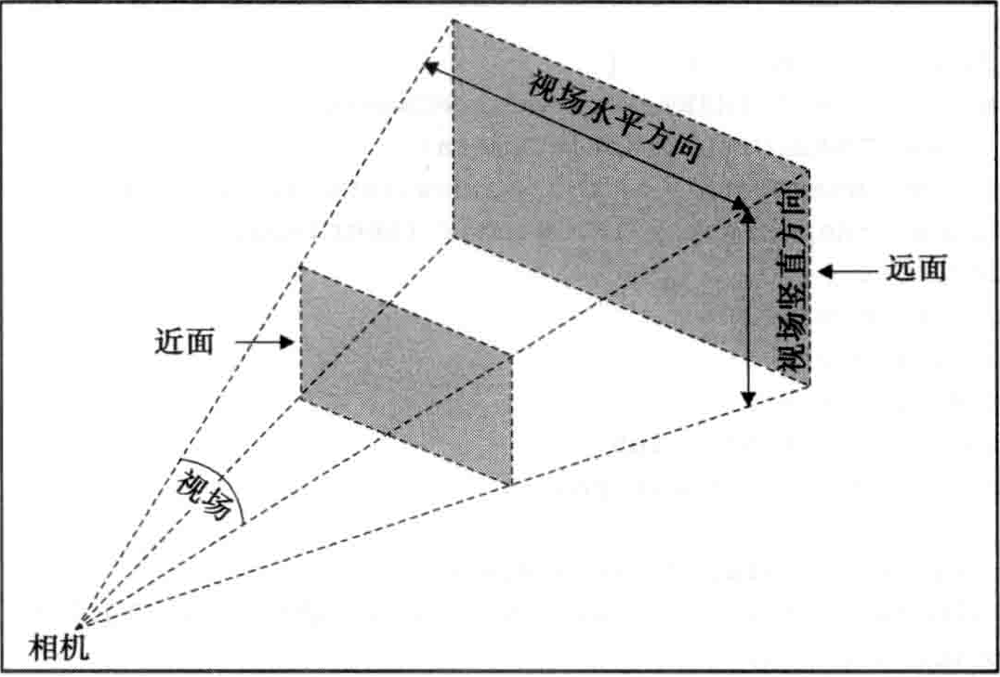

## 相机主要属性
+ position 相机位置
+ lookAt 观察点位置
+ up 可以理解为镜头在空间旋转， 相对的可以理解为三维坐标轴转化
    + 默认{x: 0, y: 1, z: 0}, 默认y正方向， 垂直向上
    + 默认{x: 1, y: 0, z: 0}, 改为x正方向， 垂直向上
    
## camera 分类
+ 透视（perspective） 与我们人眼真实效果一致，远处渲染的越小，一般场景应用,主要参数如下：
    + fov 视场 field of view  default:45
    + aspect 宽高比 通过相机看到的场景的宽高比 default: window.innerWidth/window.innerHeight
    + near 近面 default: 0.1
    + far 远面 default: 1000
+ 正投 远近物体渲染尺寸一致，某此游戏， 一些智慧城市
> picture to show meaning of perspective camera params
